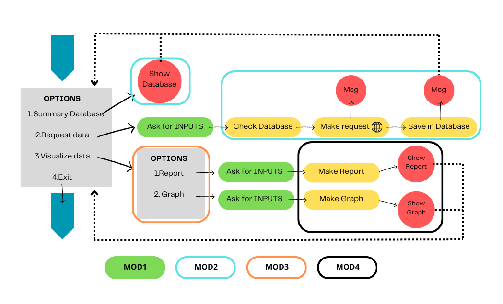

# Design and Functionality Report

## Design

## Functionality
This application runs with Python and uses the following packages: pandas, plotly, sqlalchemy and yfinance.

When the app opens it shows a main menu with four options: 
1.Summary Database 
2.Request data 
3.Visualize data 
4.Exit 
The user chooses the desired option.

The steps within each one are explained below.
 
1.Summary Database
Calls MOD2 and execute the *summary function*, which opens the database grouped by Ticker and calculates the minimum and maximum date for each one. Then it prints the summary table and returns to the main menu.

2.Request data
Calls MOD1 and asks the user to provide a ticker, a start date, and an end date. Runs the *askInputMenu function*. In the process, checks that the date format is correct and that the end date is later than the start date. The function returns a list with the following elements: [Ticker, Start date, End date].
Then it calls MOD2 and executes the *request function* which connects to yahoo finance and downloads the requested information. Afterwards saves this information in the Database(sqlite) and delets duplicates (in case some information had already been downloaded in a previous request). During the process it prints a message in each of the steps. At the end it returns to main menu.

3.Visualize data
It calls MOD3 and presents a menu where it asks the user to choose whether they want to see the data in a table or a graphic.
-If the user chooses Report, the app calls MOD1 and runs the *askInputMenu function* (already explained).
Then calls MOD4, runs the *filter function*, which opens the database as a dataframe and filters the information according to the user's request. With the *report function*, it prints the requested records in table form. If there are no records that meet the request, it prints the message "DataFrame is empty!". At the end it return to main menu.
-If the user chooses Graph, the app calls MOD1 and runs the *askInputMenu function* (already explained). Then calls MOD4 and runs the *filter function* (already explained). Afterwards it makes the graph with the *graphic function* and prints it. If there are no records that meet the request, it prints the message "DataFrame is empty!". At the end it return to main menu.

4.Exit
The application is closed.

  

 <h2><i>Web resources used</i></h2>  

  
## Links
Flow Chart Design https://www.canva.com/online-whiteboard/flowcharts/  
Yahoo Finance Tickers list https://investexcel.net/all-yahoo-finance-stock-tickers/  
Yahoo Finance https://finance.yahoo.com/trending-tickers/  
Yahoo Finance API Documentation https://pypi.org/project/yfinance/  

